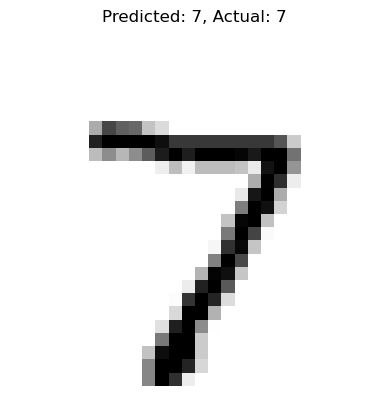

# MNIST Dataset digit recognition

Dataset: https://en.wikipedia.org/wiki/MNIST_database

Based off: https://medium.com/geekculture/deep-learning-a-to-z-part-2-mnist-the-hello-world-of-neural-networks-2429c4367086


```python
# Install packages
%pip install pandas -q
%pip install matplotlib -q
%pip install tensorflow -q
```

    Note: you may need to restart the kernel to use updated packages.
    Note: you may need to restart the kernel to use updated packages.
    Note: you may need to restart the kernel to use updated packages.


```python
import numpy as np
import matplotlib.pyplot as plt
import pandas as pd
import os
import tensorflow as tf
```

    2025-06-04 15:32:47.282117: I tensorflow/core/platform/cpu_feature_guard.cc:182] This TensorFlow binary is optimized to use available CPU instructions in performance-critical operations.
    To enable the following instructions: SSE4.1 SSE4.2 AVX AVX2 AVX512F FMA, in other operations, rebuild TensorFlow with the appropriate compiler flags.


```python
mnist = tf.keras.datasets.mnist
(X_train_full, y_train_full), (X_test, y_test) = mnist.load_data()

# Scale the values to range [0, 1]
X_train_full = X_train_full/255.
X_test = X_test/255.

# Create the validation data from training data.
X_valid, X_train = X_train_full[:5000], X_train_full[5000:]
y_valid, y_train = y_train_full[:5000], y_train_full[5000:]
```


```python
# Show a random image
plt.imshow(X_train[np.random.randint(0, len(X_train))], cmap='binary')
```


    <matplotlib.image.AxesImage at 0x7fb16c2f6f40>


    

    


```python
LAYERS = [
    tf.keras.layers.Flatten(input_shape=[28,28]),
    tf.keras.layers.Dense(300, activation="relu"),
    tf.keras.layers.Dense(100, activation="relu"),
    tf.keras.layers.Dense(10, activation="softmax")
]
model = tf.keras.models.Sequential(LAYERS)
```


```python
model.compile(loss="sparse_categorical_crossentropy",
             optimizer="SGD",
             metrics=["accuracy"])
```


```python
EPOCHS = 30
VALIDATION_SET = (X_valid, y_valid)
history = model.fit(X_train, y_train, epochs=EPOCHS,
                   validation_data=VALIDATION_SET)
```

    Epoch 1/30
    1719/1719 [==============================] - 9s 5ms/step - loss: 0.6176 - accuracy: 0.8421 - val_loss: 0.3084 - val_accuracy: 0.9180
    Epoch 2/30
    1719/1719 [==============================] - 8s 4ms/step - loss: 0.2902 - accuracy: 0.9165 - val_loss: 0.2393 - val_accuracy: 0.9342
    Epoch 3/30
    1719/1719 [==============================] - 9s 5ms/step - loss: 0.2377 - accuracy: 0.9321 - val_loss: 0.2087 - val_accuracy: 0.9426
    Epoch 4/30
    1719/1719 [==============================] - 9s 5ms/step - loss: 0.2038 - accuracy: 0.9416 - val_loss: 0.1793 - val_accuracy: 0.9492
    Epoch 5/30
    1719/1719 [==============================] - 8s 5ms/step - loss: 0.1778 - accuracy: 0.9492 - val_loss: 0.1638 - val_accuracy: 0.9568
    Epoch 6/30
    1719/1719 [==============================] - 8s 5ms/step - loss: 0.1578 - accuracy: 0.9548 - val_loss: 0.1468 - val_accuracy: 0.9608
    Epoch 7/30
    1719/1719 [==============================] - 8s 5ms/step - loss: 0.1408 - accuracy: 0.9600 - val_loss: 0.1330 - val_accuracy: 0.9636
    Epoch 8/30
    1719/1719 [==============================] - 8s 5ms/step - loss: 0.1273 - accuracy: 0.9638 - val_loss: 0.1294 - val_accuracy: 0.9642
    Epoch 9/30
    1719/1719 [==============================] - 10s 6ms/step - loss: 0.1160 - accuracy: 0.9673 - val_loss: 0.1185 - val_accuracy: 0.9674
    Epoch 10/30
    1719/1719 [==============================] - 10s 6ms/step - loss: 0.1056 - accuracy: 0.9702 - val_loss: 0.1108 - val_accuracy: 0.9686
    Epoch 11/30
    1719/1719 [==============================] - 9s 5ms/step - loss: 0.0970 - accuracy: 0.9725 - val_loss: 0.1047 - val_accuracy: 0.9722
    Epoch 12/30
    1719/1719 [==============================] - 8s 5ms/step - loss: 0.0898 - accuracy: 0.9744 - val_loss: 0.0969 - val_accuracy: 0.9746
    Epoch 13/30
    1719/1719 [==============================] - 8s 5ms/step - loss: 0.0829 - accuracy: 0.9766 - val_loss: 0.0951 - val_accuracy: 0.9742
    Epoch 14/30
    1719/1719 [==============================] - 8s 5ms/step - loss: 0.0771 - accuracy: 0.9782 - val_loss: 0.0909 - val_accuracy: 0.9744
    Epoch 15/30
    1719/1719 [==============================] - 8s 4ms/step - loss: 0.0718 - accuracy: 0.9804 - val_loss: 0.0884 - val_accuracy: 0.9752
    Epoch 16/30
    1719/1719 [==============================] - 9s 5ms/step - loss: 0.0668 - accuracy: 0.9814 - val_loss: 0.0858 - val_accuracy: 0.9762
    Epoch 17/30
    1719/1719 [==============================] - 8s 5ms/step - loss: 0.0623 - accuracy: 0.9831 - val_loss: 0.0806 - val_accuracy: 0.9760
    Epoch 18/30
    1719/1719 [==============================] - 9s 5ms/step - loss: 0.0583 - accuracy: 0.9843 - val_loss: 0.0821 - val_accuracy: 0.9760
    Epoch 19/30
    1719/1719 [==============================] - 8s 5ms/step - loss: 0.0545 - accuracy: 0.9854 - val_loss: 0.0791 - val_accuracy: 0.9772
    Epoch 20/30
    1719/1719 [==============================] - 8s 4ms/step - loss: 0.0513 - accuracy: 0.9861 - val_loss: 0.0748 - val_accuracy: 0.9796
    Epoch 21/30
    1719/1719 [==============================] - 8s 5ms/step - loss: 0.0478 - accuracy: 0.9869 - val_loss: 0.0747 - val_accuracy: 0.9778
    Epoch 22/30
    1719/1719 [==============================] - 8s 5ms/step - loss: 0.0453 - accuracy: 0.9879 - val_loss: 0.0792 - val_accuracy: 0.9774
    Epoch 23/30
    1719/1719 [==============================] - 7s 4ms/step - loss: 0.0426 - accuracy: 0.9889 - val_loss: 0.0744 - val_accuracy: 0.9774
    Epoch 24/30
    1719/1719 [==============================] - 8s 4ms/step - loss: 0.0401 - accuracy: 0.9901 - val_loss: 0.0749 - val_accuracy: 0.9784
    Epoch 25/30
    1719/1719 [==============================] - 8s 5ms/step - loss: 0.0375 - accuracy: 0.9904 - val_loss: 0.0705 - val_accuracy: 0.9794
    Epoch 26/30
    1719/1719 [==============================] - 8s 5ms/step - loss: 0.0354 - accuracy: 0.9915 - val_loss: 0.0703 - val_accuracy: 0.9792
    Epoch 27/30
    1719/1719 [==============================] - 11s 7ms/step - loss: 0.0332 - accuracy: 0.9921 - val_loss: 0.0690 - val_accuracy: 0.9794
    Epoch 28/30
    1719/1719 [==============================] - 9s 5ms/step - loss: 0.0315 - accuracy: 0.9924 - val_loss: 0.0714 - val_accuracy: 0.9792
    Epoch 29/30
    1719/1719 [==============================] - 9s 5ms/step - loss: 0.0298 - accuracy: 0.9931 - val_loss: 0.0689 - val_accuracy: 0.9798
    Epoch 30/30
    1719/1719 [==============================] - 10s 6ms/step - loss: 0.0281 - accuracy: 0.9938 - val_loss: 0.0693 - val_accuracy: 0.9814


```python
pd.DataFrame(history.history).plot(figsize=(8,5))
plt.grid(True)
plt.gca().set_ylim(0,1)
plt.show()
```


    

    


```python
loss, accuracy = model.evaluate(X_test, y_test)
print(f"Test Loss: {loss:.4f}")
print(f"Test Accuracy: {accuracy * 100:.2f}%")
```

    313/313 [==============================] - 1s 4ms/step - loss: 0.0747 - accuracy: 0.9769
    Test Loss: 0.0747
    Test Accuracy: 97.69%


```python
X_new = X_test[:3]
y_pred = np.argmax(model.predict(X_new), axis=-1)
y_test_new = y_test[:3]
for data, pred, actual in zip(X_new, y_pred, y_test_new):
    plt.imshow(data, cmap="binary")
    plt.title(f"Predicted: {pred}, Actual: {actual}")
    plt.axis('off')
    plt.show()
    print("---"*20)
```

    1/1 [==============================] - 0s 87ms/step


    

    


    ------------------------------------------------------------


    

    


    ------------------------------------------------------------


    

    


    ------------------------------------------------------------


```python

```
